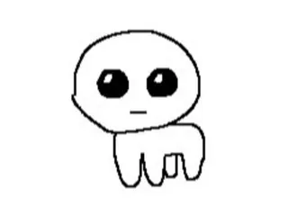

# Phase 1
- For this phase I tried to recreate a crudely drawn version of thing.
- 
- Honestly I just roughly sketched it up as soon as I got the graph paper in class
- I just had to make it face the right instead of left and all was good
- Also I was trying to make everything git nicely in the little squares on the graph paper.
- I think it turned out successful :)
- 
