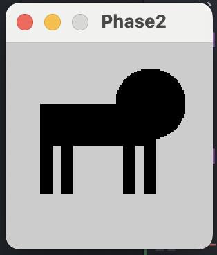

# Phase 2
- For this portion, I decided to go off the [example](https://github.com/rdwrome/261sp24/tree/main/07Midterm) provided (minus the shapes of course and went from there)
``` python
def setup():
    size(150, 150)
    noStroke()

def draw():
    fill(0)
```
- Afterwards I just started assembling what I sketched out with the shapes provided in the processing website and messing with the parameters
``` python
def setup():
    size(150, 150)
    noStroke()

def draw():
    fill(0)
    rect(100, 60,  9, 50)
    rect(40, 60,  9, 50)
    rect(85, 60,  9, 50)
    rect(25, 60,  9, 50)
    rect(25, 45,  84, 30)
    ellipse(105, 45, 50, 50)
```
- This is what I ended up with
- 
