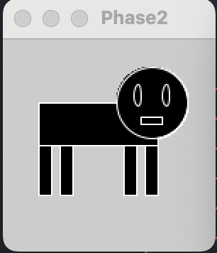

# Phase 2
- For this portion, I decided to go off the [example](https://github.com/rdwrome/261sp24/tree/main/07Midterm) provided (minus the shapes of course and went from there)
``` python
def setup():
    size(150, 150)
    noStroke()

def draw():
    fill(0)
```
- Afterwards I just started assembling what I sketched out with the shapes provided in the processing website and messing with the parameters
``` python
def setup():
    size(150, 150)
    noStroke()

def draw():
    fill(0)
    rect(100, 60,  9, 50)
    rect(40, 60,  9, 50)
    rect(85, 60,  9, 50)
    rect(25, 60,  9, 50)
    rect(25, 45,  84, 30)
    ellipse(105, 45, 50, 50)
```
- This is what I ended up with
- 
- Now there is a problem at the moment.
- It has no eyes or mouth!
- So now I had to figure out how to make white shapes to give it a face.
- After I went through the [processing website](https://processing.org/reference/#shape) I landed on the "stroke()" command which outlines all the shapes and I added the face shapes.
- Here's the code I landed on.
``` python
def setup():
    size(150, 150)
    noStroke()

def draw():
    fill(0)
    rect(100, 60,  9, 50)
    rect(40, 60,  9, 50)
    rect(85, 60,  9, 50)
    rect(25, 60,  9, 50)
    rect(25, 45,  84, 30)
    ellipse(105, 45, 50, 50)
    ellipse(95, 40, 5, 15)
    ellipse(115, 40, 5, 15)
    rect(97, 55, 15, 5)
    stroke(255)
  ```
  - And here's the result I got
  - 
  - Afterwards, I tried chucking it into the phase3 template code but it turned out that it didn't do the outlines so I decided to do a differenciation of fillings for the face and the body.
  ``` python
  def setup():
    size(150, 150)
    noStroke()

def draw():
    fill(130)
    rect(100, 60,  9, 50)
    rect(40, 60,  9, 50)
    rect(85, 60,  9, 50)
    rect(25, 60,  9, 50)
    rect(25, 45,  84, 30)
    ellipse(105, 45, 50, 50)
    fill(0)
    ellipse(95, 40, 5, 15)
    ellipse(115, 40, 5, 15)
    rect(97, 55, 15, 5)
  ```
  - And I got this as a result
  - 
