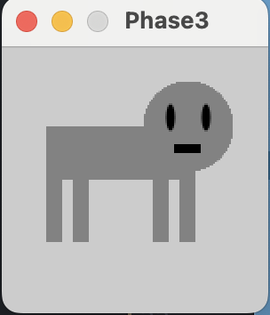

# Phase 3
- For this phase I basically did a modified version of the template code provided in the assignment [example](https://github.com/rdwrome/261sp24/tree/main/07Midterm).
- Here's the template code.
``` python
def setup():
    size(400, 400) # Set the size of canvas
    noStroke() # Disable drawing the stroke

def drawObject(x,y,s):
    push()
    translate(x,y)
    scale(s)
    fill(0) # Fill in with black color
    rect(40, 10,  60, 10) # Draw rectangles
    rect(40, 10,  5, 50)
    rect(100, 10,  5, 50)
    ellipse(30, 60, 30, 20) # Draw ellipses
    ellipse(90, 60, 30, 20)
    pop()

def draw():
    drawObject(0,0,1)
    drawObject(0,200,1)
```
- Basically what I did to modify it was take the shape guts of the phase 2 portion on the midterm, and place it into where the template shape guts used to be.
- Here's the code that I landed on
``` python
def setup():
    size(150, 150)
    noStroke()

def drawObject(x,y,s):
    push()
    translate(x,y)
    fill(130)
    scale(s)
    rect(100, 60,  9, 50)
    rect(40, 60,  9, 50)
    rect(85, 60,  9, 50)
    rect(25, 60,  9, 50)
    rect(25, 45,  84, 30)
    ellipse(105, 45, 50, 50)
    fill(0)
    ellipse(95, 40, 5, 15)
    ellipse(115, 40, 5, 15)
    rect(97, 55, 15, 5)
    pop()

def draw():
    drawObject(0,0,1)
    drawObject(0,200,1)
```
- And here's the result
- 
